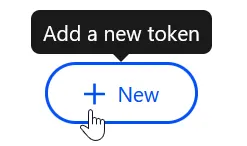
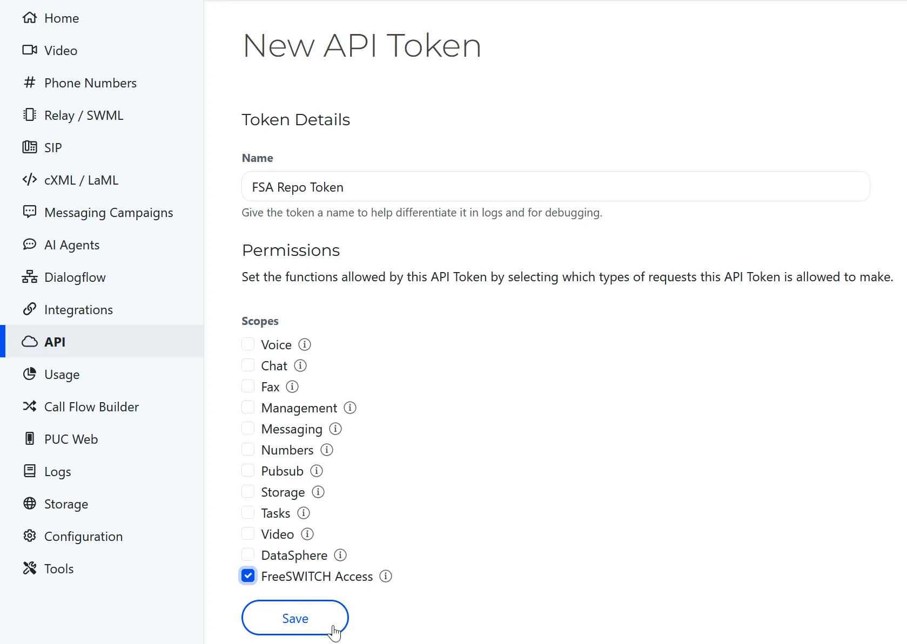
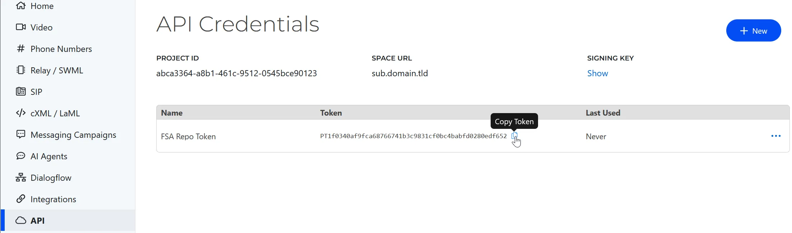

# Installing FreeSWITCH Advantage

FreeSWITCH Advantage is the commercially supported edition of FreeSWITCH
(formerly FreeSWITCH Enterprise), maintained by SignalWire. This page covers
installing it on Debian, from prebuilt packages or from source.

- Source repository: [github.com/signalwire/stack](https://github.com/signalwire/stack)
- Commit log: [github.com/signalwire/stack/commits/master](https://github.com/signalwire/stack/commits/master)
- Support: open a ticket through the support portal or email
  [support@signalwire.com](mailto:support@signalwire.com)

For the open-source Community edition, see
[Getting Started](./getting-started.mdx#installing-from-packages) instead.

## Authentication

Access to the FreeSWITCH Advantage install packages requires a **FreeSWITCH
Advantage API key access token** (referred to below as `API_TOKEN`). See
[Obtaining a FreeSWITCH Advantage API key access token](#obtaining-a-freeswitch-advantage-api-key-access-token)
at the bottom of this page.

:::caution
Use a FreeSWITCH Advantage API token, **not** a SignalWire Personal Access
Token. Personal Access Tokens are for the FreeSWITCH Community edition and will
not authorize Advantage packages.
:::

## Supported architectures

These instructions apply to all supported architectures. The
[FSGET](https://github.com/signalwire/freeswitch/tree/master/scripts/packaging)
script detects your system's architecture automatically when preparing it to
install or build FreeSWITCH. Packages are not provided for 32-bit x86 systems.

## Installing from Debian packages

### Latest release packages

```bash
TOKEN=YOUR_API_TOKEN

apt update && apt install -y curl
curl -sSL https://freeswitch.org/fsget | bash -s $TOKEN release install
```

FreeSWITCH is now installed. Connect to the console with:

```bash
fs_cli -rRS
```

### Master test packages

:::warning
The master (development) branch is not suitable for production.
:::

```bash
TOKEN=YOUR_API_TOKEN

apt update && apt install -y curl
curl -sSL https://freeswitch.org/fsget | bash -s $TOKEN prerelease install
```

## Building Debian packages from the dev branch

:::warning
Builds from the master branch are not suitable for production.
:::

The master branch depends on libraries that are not packaged in the Debian
distribution but are available from the FreeSWITCH repository. You will need
either internet access to the FreeSWITCH DEB repository through the
[FSGET](https://github.com/signalwire/freeswitch/tree/master/scripts/packaging)
script, or to follow the
[How to build FreeSWITCH dependencies](https://github.com/signalwire/freeswitch/tree/master/scripts/packaging/build/dependencies)
instructions. Package builds are automated with the
[FSDEB](https://github.com/signalwire/freeswitch/tree/master/scripts/packaging/build)
script.

```bash
TOKEN=YOUR_API_TOKEN

apt update && apt install -y git curl
curl -sSL https://freeswitch.org/fsget | bash -s $TOKEN

cd /usr/src
git clone https://github.com/signalwire/stack -b master

curl -sSL https://freeswitch.org/fsdeb | bash -s -- -b 999 -o /usr/src/fsdebs/ -w /usr/src/stack
# On a successful build, the .deb files are written to /usr/src/fsdebs
```

## Building from source

### Release branch (production)

```bash
TOKEN=YOUR_API_TOKEN

apt update && apt install -y curl
curl -sSL https://freeswitch.org/fsget | bash -s $TOKEN

# Install the build dependencies
apt-get build-dep freeswitch

# Fetch the source. Use -b to select a branch.
cd /usr/src/
git clone -b release https://github.com/signalwire/stack.git
cd stack

# The release branch is rebased frequently; this avoids merge conflicts on pull.
git config pull.rebase true

# Build and install
./bootstrap.sh -j
./configure
make
make install
```

### Latest dev branch (for testing)

:::warning
Not suitable for production.
:::

```bash
TOKEN=YOUR_API_TOKEN

apt update && apt install -y curl
curl -sSL https://freeswitch.org/fsget | bash -s $TOKEN

# Install the build dependencies
apt-get build-dep freeswitch

# Fetch the source
cd /usr/src/
git clone https://github.com/signalwire/stack.git
cd stack

# The master branch is rebased frequently; this avoids merge conflicts on pull.
git config pull.rebase true

# The -j flag parallelizes the build but causes trouble on some systems.
./bootstrap.sh -j

# Edit modules.conf to add or remove modules from the build:
# remove the leading '#' to add a module, add it to skip one.
vi modules.conf

./configure
make
make install

# Install the sound files
make cd-sounds-install cd-moh-install

# To update an installed source build later:
cd /usr/src/stack
make current
```

## Next steps

Once installed, the operational steps are the same as for the Community edition:
[starting FreeSWITCH](./getting-started.mdx#starting-freeswitch), connecting with
[`fs_cli`](./getting-started.mdx#connecting-with-fs_cli), and
[securing the default password](./getting-started.mdx#securing-the-default-password).

## Obtaining a FreeSWITCH Advantage API key access token

A SignalWire account is required to download the prebuilt FreeSWITCH Advantage
Debian packages. First,
[create a SignalWire space](https://developer.signalwire.com/guides/signing-up-for-a-space).
Then open the **API** section in the left-hand menu of the dashboard and create a
FreeSWITCH Advantage API key access token.





### Revoking a token

To revoke a token, return to the **API** section of your SignalWire space, where
your existing tokens are listed. Click the three dots at the far right of the
token's row and select **Delete** to revoke it.


